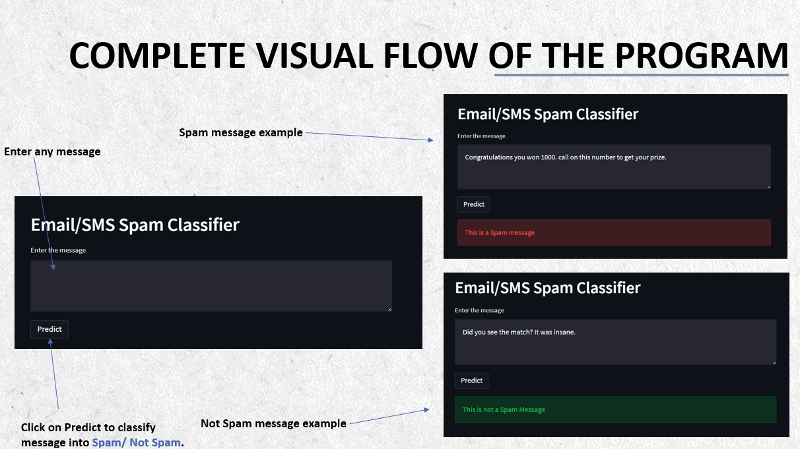
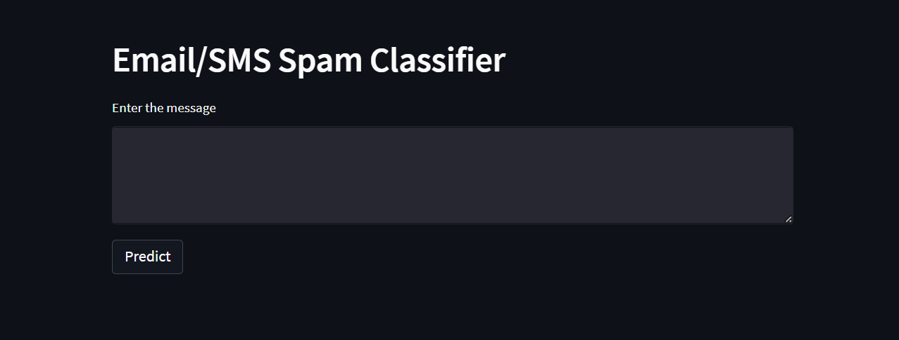

# Spam Classifier 📨✅

## Goal for this project

The main objective behind this application is to classify SMS/Email as spam or not spam using machine learning. 

With an ever-growing demand to communicate with our peers and colleagues in the institute or at jobs, we constantly have to write and check our emails. Even in the times of a global pandemic, the world had to adapt to remote working which drastically increased the need to send and receive emails. 

But this environment leads to normal people falling in trap of spammers who want to make money through unsolicited means. 

As we can imagine, Python is the ideal companion to build any kind of machine learning models. 
By using Python, we can build a machine learning model that will classify if the message received is Spam or not. 
This classification can reduce cybercrimes and make lives of normal people easier and better. 

## Tools and Softwares used

* Programming Language Used: **Python** 

* Coding Environment:
**Jupyter Notebook**
**Pycharm**

* Modules used: 
1. For graphical user interface: **Streamlit**
2. For data pre-processing: **numpy, pandas** 
3. To represent data through graphs: **matplotlib, seaborn, wordcloud** 
4. To work with human language data: **nltk** 
5. To build machine learning model: **sklearn** 
6. To export the efficient machine learning model: **pickle**
7. To hold calling the function for few seconds: **time** 

* Design Software used: **Figma** 

## NAIVE BAYES CLASSIFICATION

**Naive Bayes Classifiers** are a collection of classification algorithms based on Bayes’ Theorem. It is not a single algorithm but a family of algorithms where all of them share a common principle, i.e., every pair of features being classified is independent of each other.

**Bayes’ Theorem:** Bayes’ Theorem finds the probability of an event occurring given the probability of another event that has already occurred.

## Complete Visual Flow of the Program

## Model Preview

